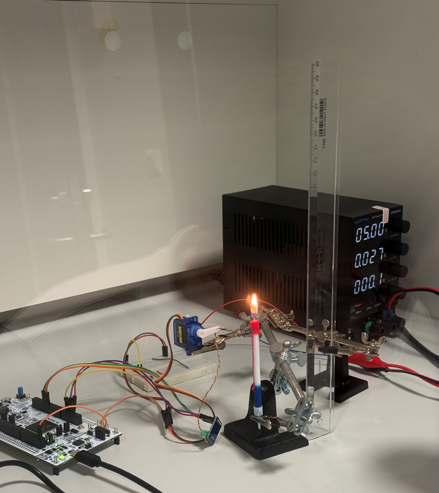
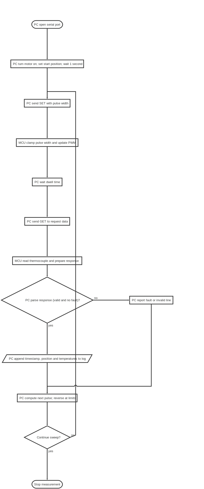
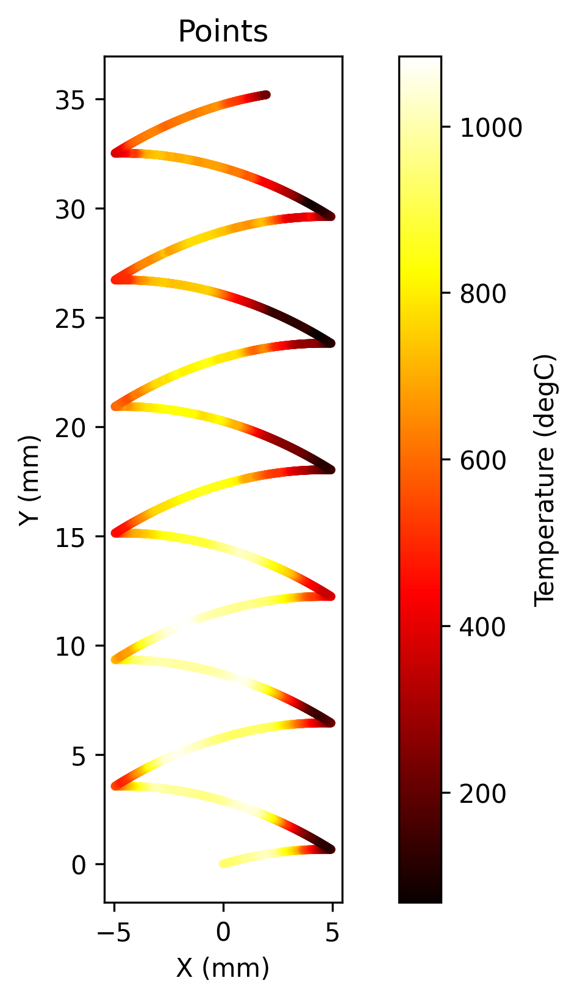
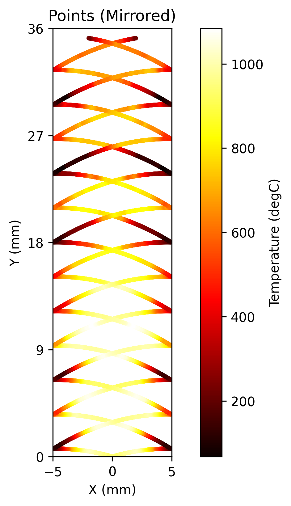
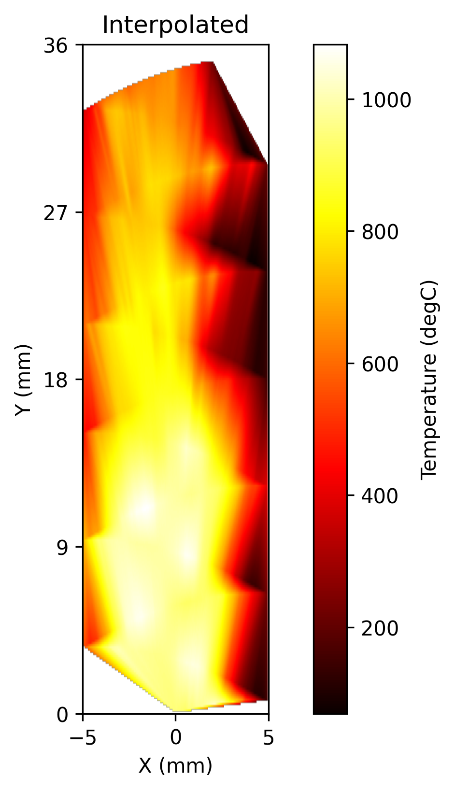
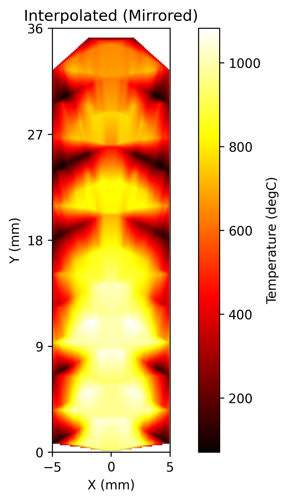
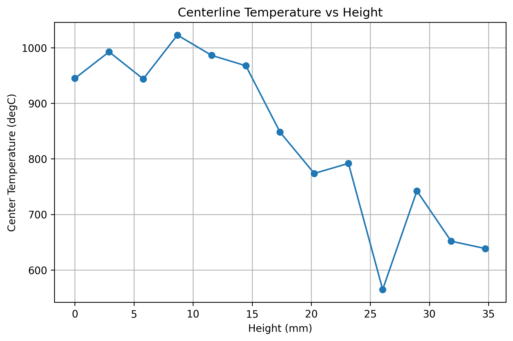

# ELE201 Semester Project Report - Candle Flame Temperature Mapping

## Abstract

We studied how the temperature inside a candle flame changes while the candle burns down. A K-type thermocouple mounted on a hobby servo swept across the flame so that every probe position could be linked to a temperature sample. The STM32 Nucleo-144 development board generated the PWM signal for the servo, read the MAX31855 thermocouple converter over SPI, and shared each measurement through a small UART command set. A Python program collected the data, converted pulse widths to spatial coordinates, and produced heatmaps that show how the flame narrows and cools as the wick collapses.

## Methodology

The experiment was designed around a clear division of responsibilities between firmware and host processing. On the microcontroller we configured timer TIM4 to generate a 20 ms PWM period (50 Hz) with a controllable pulse width between 500 microseconds and 2500 microseconds. This covered the mechanical travel of the servo while leaving safety margins on both ends. SPI4 operated as an 8-bit receive-only master with a prescaler of 32 so that the serial clock remained below the 5 MHz limit set by the MAX31855 converter. A dedicated GPIO line drove chip select. During each sampling cycle the firmware collected the thermocouple temperature, the internal cold junction estimate, and the converter fault bits. These values, together with the current pulse command and a millisecond timestamp, were returned on request through a line-based UART command called `GET`. Companion commands `SET <pulse>` and `MOTOR ON/OFF` allowed the host to move the servo while the firmware ensured that all requested pulse widths stayed inside the safe window.

The host program opened the serial connection, enabled the servo, and applied a saw-tooth scan between 1300 microseconds and 1700 microseconds. After each change of pulse width the program paused 100 milliseconds to allow the motor to reach its target position and ensure the thermocouple had time to reach thermal equilibrium. Every recorded row was written to comma-separated storage with its timestamp, measured temperature, servo position, and internal converter temperature. The interaction between the MCU and PC can be visualized by the following flowchart.

The analysis stage then transformed each pulse width into an angle by linearly relating the commanded pulse to the servo travel limits:

$$
\theta(p) = \theta_{\text{min}} + (\theta_{\text{max}} - \theta_{\text{min}}) \frac{p - p_{\text{min}}}{p_{\text{max}} - p_{\text{min}}}
$$

Here we used $\theta_{\text{min}} = -90^\circ$, $\theta_{\text{max}} = 90^\circ$, $p_{\text{min}} = 2500$ microseconds, and $p_{\text{max}} = 500$ microseconds based on the mechanical calibration performed before the measurements. We measured that the servo arm $r = 16$ mm. The horizontal displacement of the probe followed

$$
x(\theta) = r \sin(\theta),
$$

while the instantaneous vertical position combined the radial projection and the natural regression of the candle with an offset that pins the first sample to the initial wick height:

$$
y(\theta, t) = r \cos(\theta) + v t - r,
$$

with $v = 40\,\text{mm} / (10 \cdot 60\,\text{s})$ estimated from video of the burn. Subtracting the radius $r$ sets $y = 0$ at the first measurement position. We assumed that the single wick produced a symmetric flame, so each sample was mirrored as $(x, y, T) \mapsto (-x, y, T)$ to increase spatial coverage before the temperatures were interpolated on a regular grid.

## Challenges

The changing shape of the flame was the most significant challenge. As the wick bent and shortened, the hottest region drifted laterally and vertically, so it was difficult to capture a single, repeatable temperature field. We expected the communication layer to be demanding, yet the simple UART command set made it reliable once the bounds were enforced in firmware. Conversely, we assumed that probe alignment would be straightforward, but minor mechanical offsets caused noticeable asymmetry and required several recalibrations. Another unexpected difficulty was settling time: when the dwell delay was too short, the recorded temperatures lagged behind the actual flame temperature because the thermocouple junction could not equilibrate quickly enough.

## Conclusion

We first examine the raw spatial samples. The plot below follows the servo arc and shows how the measurement plane moves as the candle shortens; early samples cluster near the initial wick height, while later samples shift downward with time.

To increase spatial coverage, we then mirror the data about the centerline. This highlights small alignment errors while the hottest measurements remain close to the axis.

Interpolating the scattered measurements without mirroring exposes the inherent asymmetry of the flame as it leans and narrows.

Applying the same interpolation to the mirrored dataset emphasises the dominant axial structure while smoothing out the mechanical offsets.

Finally, the centerline profile summarises how the hottest core changes over height. Ideally, this would decrease smoothly, but the bending and shortening of the wick introduce deviations from a simple trend.

## AI Declaration

Artificial intelligence tools were used as a supplementary resource throughout the project. They assisted primarily with language editing, document structure, and generating preliminary code templates or conceptual outlines during firmware development.

## References

MAX31855 Thermocouple-to-Digital Converter Datasheet: https://www.analog.com/media/en/technical-documentation/data-sheets/max31855.pdf

## Appendix

Code repository: https://github.com/tobiasslethei/flame_logger
